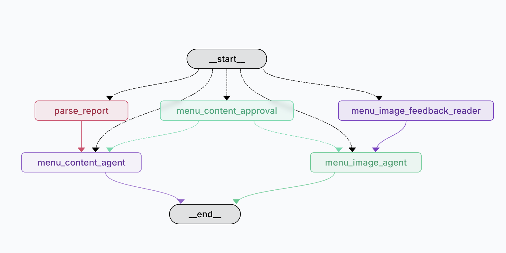

# Menu Generation Agent

 

A LangGraph-powered agent that generates restaurant menu concepts from PDF reports and creates visual menu designs with iterative user feedback.

## Overview

This agent takes restaurant concept reports (converted from PDF to markdown) and generates:
1. **Menu Content** - Text-based menu items with pricing and descriptions
2. **Visual Menu Design** - Generated menu images with proper styling
3. **Iterative Refinement** - User feedback loop for both content and visuals

## Setup

This project uses **uv** as the package manager for dependency management.

### Prerequisites
- Python 3.8+
- uv package manager
- LangGraph CLI

### Installation

1. Install dependencies:
```bash
uv syncim 
```

2. Start the local LangGraph server:
```bash
langgraph dev
```

## Usage

### PDF Processing

PDFs should be converted to markdown before being processed by the agent. This is typically handled outside the agent to make content ingestion easier.

See the example in `pdf_parsing_example/`:
- `restaurant_report.pdf` - Original PDF report
- `pdf_to_markdown.py` - LangChain-based PDF to markdown converter  
- `restaurant_report.md` - Processed markdown output

### Agent Workflow

1. **Report Parsing** - Extracts restaurant name, cuisine, location, and budget range
2. **Menu Content Generation** - Creates comprehensive menu with items and pricing
3. **User Approval Loop** - Gets feedback and iterates on menu content until approved
4. **Visual Menu Generation** - Creates styled menu images using image generation tools
5. **Visual Feedback Loop** - Refines menu visuals based on user feedback

### Example Flow

```
PDF Report � Markdown � Agent Processing � Menu Content � User Approval � Visual Design � Final Menu
```

## Project Structure

- `agent.py` - Main LangGraph agent implementation
- `configuration.py` - Agent configuration and context
- `pdf_parsing_example/` - Example PDF processing workflow
- `langgraph.json` - LangGraph server configuration

## Features

- **Multi-modal Processing** - Handles text and image generation
- **Feedback Loops** - Iterative improvement based on user input  
- **Flexible Configuration** - Configurable models and prompts
- **State Management** - Robust state tracking through the workflow
- **PDF Integration** - Easy PDF report ingestion via markdown conversion

## Development

Start the development server:
```bash
langgraph dev
```

The agent will be available for testing through the LangGraph interface.